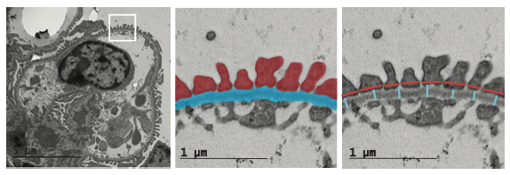

# Digital Biopsy Pipeline
This is an automated TEM image measurement pipeline for Glomerular Basement Membrane Width (GBMW) and Foot Processes width (FPW).

<p align="center"></p>

The UNet segmentation code is adapted from [here](https://github.com/johschmidt42/PyTorch-2D-3D-UNet-Tutorial)

The deprecated version of this project can be found [here](https://github.com/digital-biopsy/GBM_measurement_pipeline_deprecated.git)

## Acknowledgements
This project is part of Boston University Bioengineering Senior Thesis 2022. We thank the invaluable help provided by our principal investigators: Dr. Weining, Lu; Dr. Joel M. Henderson; and Dr. Vijaya B. Kolachalama. The abstract has been admitted to [ASN Kidney Week Abstract 2022](https://www.asn-online.org/education/kidneyweek/2022/program-abstract.aspx?controlId=3766852)

Zhaoze Wang and Aksel Laudon developed the machine learning model. Aksel Laudon, Connor Kim, Yingzhe Qian, and Qin Ye developed the image processing algorithms and annotated the GBM labels. Aksel Laudon provided statistical analysis. Weining Lu provided the TEM images.

## Installation
### Prepare the environment (optional but recommended)
It is recommended to install the package dependencies in an [Anaconda](https://www.anaconda.com/products/individual) or [Miniconda](https://docs.conda.io/en/latest/miniconda.html) environment. To install, check out the official installation guide for [Anaconda](https://docs.conda.io/projects/conda/en/latest/user-guide/install/index.html) and [Miniconda](https://docs.conda.io/en/latest/miniconda.html#installing).
- Create a conda environment
    ```
    conda create -n digital-biopsy python=3.8
    ```
- Activate the environment
    ```
    conda activate digital-biopsy
    ```
- Deactivate the environment
    ```
    conda deactivate
    ```
### Install the dependencies
```
pip install -r requirements.txt
```

## Run the code
Configuring this pipeline involves two parts of the settings:
- Arguments parsed from the command line: these arguments primarily control what task to perform, e.g., pre-processing, segmentation, measurement, evaluation, etc.
- Parameters defined in `params.yaml`: these parameters primarily control the hyperparameters of the model, e.g., how to tile the image, training parameters, and some constants of the input images (pixel/nm ratio), etc.

## Arguments syntax
```
python main.py [-h] [-prep [DATASET]] [-i] [-v]
```
### Task arguments
These arguments control what task to perform. They are mutually exclusive, meaning only one of them can be used at a time.
`-prep`: 
    Pre-process the dataset. This will perform the image cropping, image shuffling, and subject-wise k-fold cross-validation (CV). As the data stored in the 'stats.csv' is performed by multiple operators and lacks format consistency, it will also perform the corner case handling to exclude the data that does not contain a desired stats entry (GBMW or FPW, etc.) <br>
### Other arguments
`-v`: Verbosely print the current training process, helpful for debugging.
#### Prepare the dataset
##### args
To load the images to the UNet as well as the pipeline, the images needed to be pre-processed (cropped) into smaller image patches. This can be done by running the following command. This command will automatically create a folder named `data/` under the project root directory if there is not one and store the pre-processed data in it. <br>
This argument requires an additional parameter, which is the `<name of the dataset>` or `all`, which will specify which folder (dataset) to pre-process under the datapath. The image processing pipeline requires a specific structure of the data. See [Dataset structures](#dataset-structures) for more details.
```
python main.py -prep [dataset name]
```
##### Related params
| Parameter           | Default          | Required     | Description                                    |
| ------------------- | ---------------- | -------------| ---------------------------------------------- |
| `datapath`          | `data/`          | yes          | The path to the dataset.                       |
| `downsample_factor` | 2                | no           | The downsample factor of the image. Namely, how many pixels are averaged into one pixel on each dimension. E.g., 2 means 4 pixels are averaged into one pixel. |
| `tile_size`         | 512              | no           | The size of the image patch. (width = height)  |
####


## `params.yaml`


## Dataset structures
For raw data, we require it to be stored in the following structure.
```
|-datapath/ </br>
|---dataset/ </br>
|-----stats.csv </br>
|-----inputs/ </br>
|-------img-name-1.jpg </br>
|-------img-name-2.jpg </br>
|------- ... </br>
|-----labels/ </br>
|-------img-name-1.png </br>
|-------img-name-2.png </br>
|------- ... </br>
```
`datapath` is the root directory of all datasets. We designed it in the following way as the mice biopsy data could be sampled from different mice or different time points. It will be easier to manage the data if we store them in different `dataset` folders. In each `dataset` folder, three component is required: 1. `inputs` is the folder that contains all the raw images. 2. `labels` is the folder that contains all the labels. The label name must be an exact match of the input name. 3. [Optional:] the `stats.csv` file that contains the 'expert' measurement of the dataset. If the directory does not contain the `stats.csv` file, the program will not be able to perform the measurement evaluation. <br>
In the above example, the part 'img-name-1' could be replaced by an arbitrary string as long as there's a corresponding label with the same name in the `labels` folder. <br>
**NOTE**: All names must be unique; otherwise, the program will overwrite the existing file with the same name and cause unexpected behavior.


## arg '-prep'
This argument will pre-process the image. It will perform the image cropping, image shuffling, and subject-wise k-fold cross-validation (CV). As the data stored in the 'stats.csv' is performed by multiple operators and lacks format consistency, it will also perform the corner case handling to exclude the data that does not contain a desired stats entry (GBMW or FPW etc.)
### Related params (params_meta.py)
kfold = 5 (0 if all in inputs, 1 if all in tests, 5 by default (80% train 20% test))
sliding_step = 300 (the step size of the sliding window after downsampling. i.e, the raw imga are first downsampled before performing the sliding window).
### Generated Dataset
The '-prep' command will first initialize a Pre-process instance by loading all the pre-processing parameters. Then it reads all the raw image-label pairs in and stores their absolute path in 'project_root/data/kfold/inputs-<subject-groupname>.txt'. The subject-wise kfold will require kfold shuffle before cropping. Hence, Preprocessor will first shuffle the subjects and store them in 'project_root/data/kfold/fold_<n>/', append the corresponding raw-image and raw-label input train/test list according to the current fold, and perform the cropping. </br>
The cropped training image tiles are stored in the 'project_root/data/labels/' and 'project_root/data/inputs/' folder. The testing labels and inputs are stored in the 'inputs' and 'labels' folder under the 'project_root/data/test/'. The validation folder is a legacy folder. We currently use in-line validation that is randomly selected during training, so this folder is no longer needed.

### Generated Dataset Structure
|-project_root/data/ </br>
|---tile_stats.csv </br>
|---kfold/ </br>
|-----fold_0/ </br>
|-------inputs.txt (all abs path of input imgs of this fold) </br>
|-------labels.txt (all abs path of labels of this fold) </br>
|-----fold_1/ </br>
|-------inputs.txt (all abs path of input imgs of this fold) </br>
|-------labels.txt (all abs path of labels of this fold) </br>
|-----inputs-<subject-groupname-1>.txt (abs paths of imgs in this group) </br>
|-----labels-<subject-groupname-1>.txt (abs paths of labels in this group) </br>
|-----inputs-<subject-groupname-2>.txt (abs paths of imgs in this group) </br>
|-----labels-<subject-groupname-2>.txt (abs paths of labels in this group) </br>
|---inputs/ (all cropped trainset inputs) </br>
|---labels/ (all cropped trainset labels) </br>
|---test/
|-----inputs/ (all cropped testset inputs) </br>
|-----labels/ (all cropped testset labels) </br>

## To-Do List
- [x] Randomize the train test split.
- [x] Add data (input/target/test) into .gitignore.
- [x] Test if the current model works on cpu devices.
- [x] Train test split already included in the code. Delete the validation folder.
- [x] Integrate the image tiling with the training script.
- [ ] Refactor code to enable training on server/local PC.
- [ ] Check the optimizer logic
- [ ] Add grayscale augmentation methods to prevent overfitting on color.
- [x] Move parameters to 'params_meta.py'
